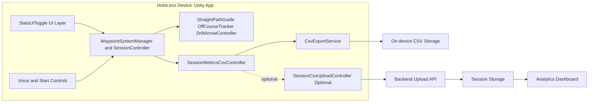

# GaitRehabFYP

HoloLens rehabilitation application for guided straight-line gait sessions, in-session feedback, and session metric export.

This repository contains the Unity app that runs on HoloLens. It is the data-capture side of the project and can optionally upload CSV session data to the analytics backend.

## System Role

GaitRehabFYP is the mixed reality front end of the full gait-rehab pipeline.

1. The user runs guided walking sessions in HoloLens.
2. The app tracks session metrics such as speed, on/off course, and drift.
3. Metrics are saved to CSV on-device.
4. Optionally, each CSV row is uploaded to the backend endpoint for dashboard visualization.

## Tech Stack

- Unity 2019.4.40f1 (LTS)
- C# MonoBehaviour architecture
- MRTK 2.8.3 (Mixed Reality Toolkit)
- XR Management + Windows MR packages
- UWP build target for HoloLens deployment

Unity version reference:
- [ProjectSettings/ProjectVersion.txt](ProjectSettings/ProjectVersion.txt)

Package manifest:
- [Packages/manifest.json](Packages/manifest.json)

## Key Features

- Straight-line gait guidance with visual path aids
- Manual and dwell-based session start
- Voice command controls for stats, metronome, pause/resume, and session end
- Off-course detection and drift direction feedback
- Session completion summary overlay
- CSV export for startup checks and session metrics
- Optional CSV upload to backend API

## Architecture Diagram

Flow summary:

1. Session control and UI drive the core session manager.
2. Session manager computes gait metrics and guidance state.
3. Metrics are written to local CSV on-device.
4. If enabled, CSV rows are uploaded to backend for centralized analytics.

## Repository Layout

- [Assets/Scenes](Assets/Scenes): Unity scenes (current main scene: SampleScene)
- [Assets/Scripts](Assets/Scripts): Core app logic
- [ProjectSettings](ProjectSettings): Unity project configuration
- [Packages](Packages): Unity package dependencies

## Core Scripts

- [Assets/Scripts/WaypointSystemManager.cs](Assets/Scripts/WaypointSystemManager.cs): Main session flow and metric coordination
- [Assets/Scripts/SessionController.cs](Assets/Scripts/SessionController.cs): Session lifecycle and derived metrics
- [Assets/Scripts/StatsUiToggle.cs](Assets/Scripts/StatsUiToggle.cs): Runtime UI, controls, and integration toggles
- [Assets/Scripts/StartSessionControlController.cs](Assets/Scripts/StartSessionControlController.cs): Start button and gaze-dwell start logic
- [Assets/Scripts/VoiceCommandController.cs](Assets/Scripts/VoiceCommandController.cs): Voice command registration and dispatch
- [Assets/Scripts/MetronomeController.cs](Assets/Scripts/MetronomeController.cs): Visual/audio pacing feedback
- [Assets/Scripts/OffCourseTracker.cs](Assets/Scripts/OffCourseTracker.cs): Off-course and lateral drift tracking
- [Assets/Scripts/CsvExportService.cs](Assets/Scripts/CsvExportService.cs): CSV writing on UWP and non-UWP paths
- [Assets/Scripts/SessionMetricsCsvController.cs](Assets/Scripts/SessionMetricsCsvController.cs): Session metric row generation
- [Assets/Scripts/SessionCsvUploadController.cs](Assets/Scripts/SessionCsvUploadController.cs): Optional upload to backend endpoint

## CSV Schema

Session metric rows include:

- timestamp_utc
- completion_title
- distance_m
- elapsed_s
- avg_speed_mps
- pace_s_per_m
- on_course_percent
- off_course_percent
- off_course_seconds
- drift_avg_m
- drift_max_m
- app_version
- unity_version
- device_model

Generated by:
- [Assets/Scripts/SessionMetricsCsvController.cs](Assets/Scripts/SessionMetricsCsvController.cs)

## Prerequisites

- Unity Hub
- Unity Editor 2019.4.40f1 with UWP build support
- Visual Studio 2022 (or 2019) with UWP workload and C++ tools
- HoloLens 2 device (for deployment) or Unity editor for development checks

## Local Development (Unity Editor)

1. Open the project folder in Unity Hub.
2. Use Unity 2019.4.40f1.
3. Open [Assets/Scenes/SampleScene.unity](Assets/Scenes/SampleScene.unity).
4. Press Play in the editor to validate scene logic and UI behavior.

## Build and Deploy to HoloLens

1. In Unity, open File > Build Settings.
2. Select Universal Windows Platform.
3. Typical target settings:
	- Target Device: HoloLens
	- Architecture: ARM64
	- Build Type: D3D
4. Build to a folder.
5. Open the generated Visual Studio solution.
6. Build and deploy to device (Release + ARM64, Remote Machine/Device).

Note: exact deployment profile can vary based on your lab/device setup.

## Backend Upload Integration (Optional)

The app can upload session CSV rows to your backend endpoint.

Configure in the inspector on [Assets/Scripts/StatsUiToggle.cs](Assets/Scripts/StatsUiToggle.cs):

- uploadSessionMetricsCsvToBackend = true
- backendSessionCsvUploadUrl = your backend upload endpoint
- backendSessionCsvUploadTimeoutSeconds = timeout in seconds
- uploadSampleSessionMetricsCsvOnLaunch = optional test upload

Expected endpoint format example:

- http://YOUR_HOST:4000/api/sessions/upload

Important:

- Do not use localhost when testing from HoloLens device.
- Use your machine LAN IP or deployed backend URL.

Uploader implementation:
- [Assets/Scripts/SessionCsvUploadController.cs](Assets/Scripts/SessionCsvUploadController.cs)

## CSV Storage Behavior

CSV writing behavior is managed by [Assets/Scripts/CsvExportService.cs](Assets/Scripts/CsvExportService.cs).

- On UWP: writes to PicturesLibrary folder (default folder name: GaitRehabFYP_CSV)
- On non-UWP/editor paths: writes to application persistent data path
- Optional additional USB-visible copy can be enabled for non-UWP fallback scenarios

## Voice Commands

Defined in [Assets/Scripts/VoiceCommandController.cs](Assets/Scripts/VoiceCommandController.cs):

- show stats
- hide stats
- metronome
- metronome on
- metronome off
- pause
- resume
- end session
- finish test

## Companion Components

This repository is the HoloLens capture app. It can be paired with:

- Gait analytics backend API for CSV ingestion
- Gait analytics dashboard/web app for session visualization and anomaly review

## Troubleshooting

- If upload fails, verify endpoint URL, network reachability, and backend CORS.
- If files are not visible where expected, check platform-specific CSV path behavior.
- If scene appears unresponsive, verify camera/MRTK setup and scene object references in inspector.
